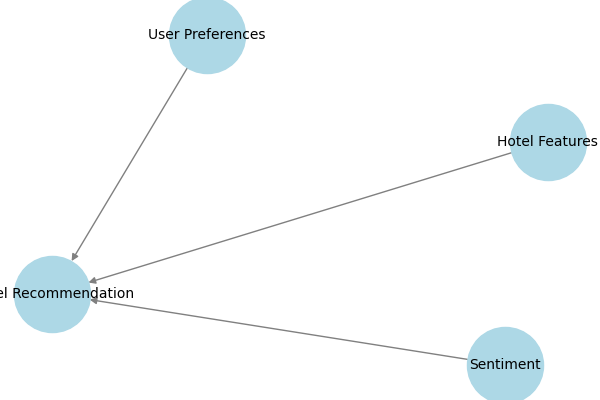
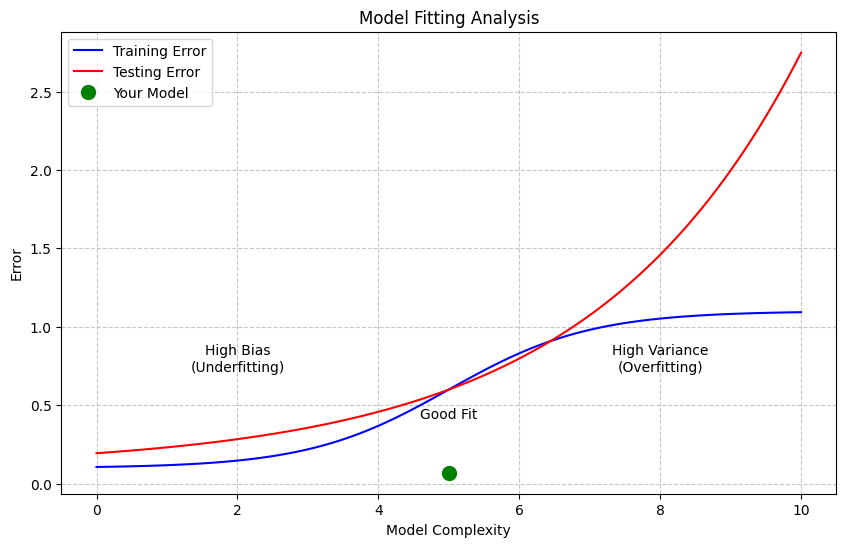

# Hotel Recommendation System
### By: Akshat Jain, Ryan Wong, Eunice Cho

Our project implements a hotel recommendation system using Naive Bayes. Our system will recommend hotels based on customer reviews, price, and reviewer score. The goal of our model is to produce the best hotel option for the user.

Bayesian Network:

## Model Accuracy & Overfitting Analysis  

Our Bayesian Network model achieved an accuracy of **93.21%** when predicting hotel recommendations based on sentiment, reviewer score, and price.  

The plot below illustrates how model complexity affects training and testing error. The green dot represents our model’s position, showing that it has low error. This means our model has a good balance between underfitting and overfitting.  

  

A well-fitting model should have a small gap between training and testing error, avoiding both high bias (underfitting) and high variance (overfitting). Our model appears to generalize well, but further tuning could help optimize performance.  

Explain what your AI agent does in terms of PEAS. What is the "world" like? 

Our agent is a hotel recommendation system which aims to produce the best hotel option for the user. The performance measure will be user feedback on how they rate the hotel we recommend to them. The environment will be the device the user uses to interact with the model. The actuators are the hotels that our agent recommends to the users based on their hotel preferences and hotel reviews. The sensors will be the data we receive from users about how much they are willing to spend on a hotel as well as which type of hotel they would like to stay in.

What kind of agent is it? Goal based? Utility based? etc. 

Our agent is a goal-based agent which aims to recommend hotels that aligns with the user preferences. The agent uses probabilistic reasoning through Naive Bayes, which calculates the likelihood of a hotel being a good fit for a user based on their preferences. 

Describe how your agent is set up and where it fits in probabilistic modeling

Our agent works by analyzing the training data then creating a CPT for each feature. The CPTs are then used to calculate the likelihood of a hotel being a good fit for a user based on their preference for price and rating. The agent then recommends the hotel with the highest likelihood.

Our hotel recommendation agent uses the Naive Bayes classifier where the conditional probabilities are calculated to represent the likelihood of a recommendation given certain features. 

We performed sentiment classification by categorizing the reviews as positive, neutral or negative baseed on the count of positive and negative words.

The sentiment of the hotel reviews was classified using the provided columns:

Review_Total_Positive_Word_Counts: Total number of positive words in the positive review.
Review_Total_Negative_Word_Counts: Total number of negative words in the negative review.

Each hotel has a positive and negative review. There is a column of the counts of positive words in the positive review and a column of the counts of negative words in the negative review. The sentiment classification is done by comparing the number of positive words and negative words against each other. If the count of positive words is more than the count of negative words then we classify it as positive. If the count of negative words is more than the count of positive words than we classify the count as negative. Finally, if the count of positive words and negative words are equal to each other, then we classify it as neutral.

Then we binned the reviewer score and price binning. The price category is in bins of affordable/expensive and the reviewer score is in bins of low/high.

Then we computed the hotel recommendation score which is computed for each hotel based on its reviewer score and sentiment. This score is used to create a binary label for whether a hotel is recommended or not.

Our agent relies on the CPT to store and calculate the probability of a hotel being recommened given the combinations the features: sentiment, reviewer score bin, price bin

We implemented laplace smoothing to ensure there are no missing probabilities in our CPT. 

The probability of our hotel being recommended is calculated based on the conditional probabilities of each feature (sentiment, reviewer score, price) given the recommendation label

Our agent uses the conditional probabilites to infer the likehood of a recommendation for a given hotel. It chooses the probability of a hotel being recommneded (1) or not recommended (0) and then it picks the higher probability from the model's output.

There are two ways the user can interact with the model

The first way is by providing a hotel name and the agent will say whether the hotel is recommended or not

The second way is by finding the best hotel based on price preference and inputting t he minimum reviewer score which then returns a list of top recommended hotels based on the stored probabilities

Our agent works by analyzing the training data then creating a CPT for each feature. The CPTs are then used to calculate the likelihood of a hotel being a good fit for a user based on their preference for price and rating. The agent then recommends the hotel with the highest likelihood.

Our data
https://www.kaggle.com/datasets/maelysboudier/hotel-prices-in-europe 
https://www.kaggle.com/datasets/jiashenliu/515k-hotel-reviews-data-in-europe

Conclusion

From our first iteration, we can see that our model has initial good fitting. As seen on the graph, our model is not over or underfit. However, we can make more improvements by taking into account the user's preferences such as size, budget range, etc.

Our model achieved an accuracy of 93.21% which means our hotel recommendation system is performing well. There is room to improve in our model by incorporating more features that the user will consider such as including time of year to consider the season and by incorporating hotel amenities. 

To further enhance our model, we plan on implementing more advanced techniques such as modifying our CPT with additional features and improving user interaction for greater usability.  
