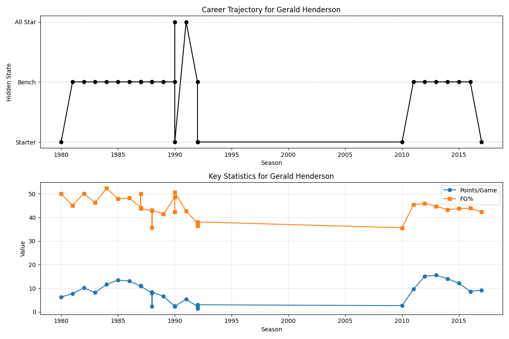

# Milestone 3: Basketball Player Performance Analysis using GaussianHMM

### By: Akshat Jain, Eunice Cho, Ryan Wong for CSE 150A Winter '25

### Synopsis  
Our project is about using basketball player statistics with Hidden Markov Models (HMMs), specifically a Gaussian Hidden Marov Model. The model categorizes players into different performance states based on their playing stats over many seasons. The states we chose are starter, bench, and all start.

## PEAS and Agent Analysis

### Introduction  
The agent identifies player career phases based on their performance stats from different years.

### Performance Measure, Environment, Actuators, Sensors (PEAS)  
- Performance Measure: The performance measure is the log likelihood of our model when untrained data (20%) is inputted
- Environment: The model operates in regards to NBA analytics, using historical NBA player stats to make predictions.  
- Actuators: The model can output a predicted performance phase (the hidden state) for each player, given a season. 
- Sensors: The sensors are the inputs given to the model, which is a player and the player's stats for a given season.

### Type of Agent  
The agent is goal-based, intending to provide a probabilistic classification of a player's career for a given year. It utilizes the GaussianHMM.

## Agent Setup, Data Preprocessing, and Training

### Dataset Exploration  
- Dataset Overview  
  - We used an NBA player statistics dataset found on Kaggle.  
    - Dataset: [NBA Player Stats Dataset](https://www.kaggle.com/datasets/loganlauton/nba-players-and-team-data?select=NBA+Player+Stats(1950+-+2022).csv) 
    - From the dataset above, we chose the csv file that has data ranging from 1950 to 2022 
  - The dataset has data from different seasons, including:  
    - Player Name  
    - Season  
    - Position  
    - Age  
    - Team  
    - Games Played  
    - Field Goal Percentage  
    - 2-Point & 3-Point Percentage  
    - Free Throw Percentage  
    - Assists, Rebounds, Personal Fouls, and Total Points 
  - However some of these features were missing from the dataset for some of the entries, so we chose to remove many columns altogether. We also refined the features to the more influential ones (shown below), and engineered some of our own

- Features we used in our model and their relevance:
  - Age: The experience a player has and whether they might have a (dis)advanage because of it
  - Games Played: How much experience the player might have from that season
  - Field Goal Percentage: How good of a shooter the player is
  - Points Per Game: How many points the player is scoring, how much of a contributor to the team
  - Assists Per Game: Shows teamwork and how valuable the player also can be to the team
- Features we engineered:
  - Points Per Game **Change**: How consistent the player is with the points
  - Field Goal Percentage **Change**: How consistent the player is with shooting 
  - Assists Per Game **Change**: How consistent the player is with their playstyle and teamwork

## Model Selection and Structure  
- Model Choice  
  - We selected the Gaussian Hidden Markov Model (GaussianHMM) because it is great for an analysis where time is a key factor. It can use that with the other features to categorize the player accordingly. We also chose to use the GaussianHMM from the hmmlearn library as it has great functionality for this.
- Structure Explanation  
  - The model uses the statistics of each season as input and then assigns the states we determined (starter, bench, all start) 

## Parameter Estimation  
- Rookie, Bench, All Star
  - We chose these because they reflect common states for NBA players over time, with some staying in them for long periods of time, while others quickly moving around (i.e. an injury)
- The model uses a transition matrix to represent the probabilities of transitioning between each career state
  - Emission parameters were also estimated to determine the distribution of each feature for each state
  - The initial state distribution was also created to determine rthe probability of starting in each career state
- Functions used  
  - GaussianHMM for hidden state prediction  
  - StandardScaler for feature normalization  
  - Train-test splitting to validate model performance  
- Libraries  
  - numpy – calculations  
  - pandas – data processing  
  - hmmlearn – Gaussian HMM implementation  
  - matplotlib.pyplot – to visualize

## Training Process  
- For training process we first standardized are features which is important for the HMM because want all our features to contribute equally to the model. We are preventing features with larger scales such as points per game from having more significance over the smaller scaled features such as field goal percentage. We then perform a 80% 20% train test split with the random_state 69 to ensure reproducibility using the same random seed each time we split. We then initialized our HMM Gaussian model and we used this because we have continuous features. We specified the model with three hidden states and used a full covariance matrix for each state so we have the correlations between the features and each state. We then trained our model on X_train. This initializes the transition matrix, emission probabilities, and the initial state and keeps updating until it reaches convergence or until reaching 200 iterations. 

## Conclusion and Results  

### Performance Evaluation  
- Results Summary  
  - Our GaussianHMM model achieved a log-likelihood score of -48801.53676426046 on the test set.  
  - The model successfully segmented players into performance states such as All Star, Bench, and Starter.  
- Visualizations  
  - The graph below shows player state transitions over seasons.  

### state distribution

### Interpretation of Results  
- Performance Analysis  
  - The model semi-accurately is able to categorize players with an overall accuracy of 39.54%.
  - Players tend to rapidly decline once they are an All Star or Starter and once they are Becnhed, stay there..
- Comparison to Baseline  
  - A random classification would achieve significantly lower log-likelihood, confirming that our model learns meaningful states. 

### Predictions for Certain Players:
Eddie Johnson:

Gerald Henderson:

Mike Dunleavy:

### Areas for Improvement  
- Increase number of hidden states: Trying more states states instead of 3 to capture more phases, as starter, bench, and all star can be too broad
- Regularization: We should add regularization to prevent overfitting of the data, especially with the transition matrix
- Normalize for the era in basketball as well: Adding features that account for different NBA eras (for example, when fouls were less common)

## Sources  
- [NBA Player Stats Dataset](https://www.kaggle.com/datasets/loganlauton/nba-players-and-team-data?select=NBA+Player+Stats(1950+-+2022).csv)  
- [hmmlearn Documentation](https://hmmlearn.readthedocs.io)  
- [Pandas Library](https://pandas.pydata.org/)  
- [Scikit-Learn](https://scikit-learn.org/)  

